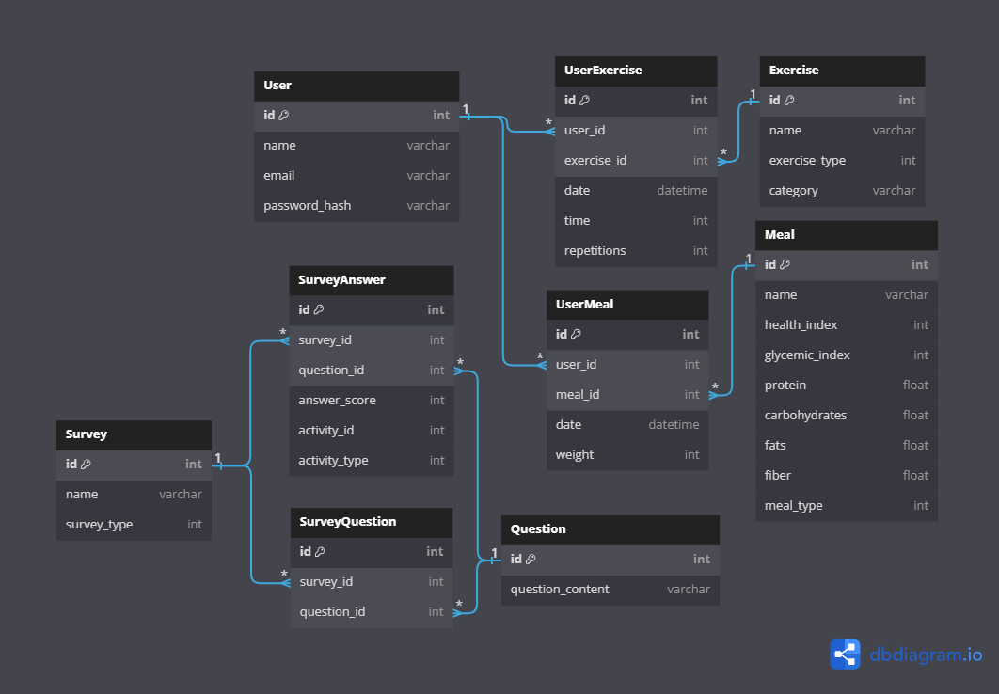

# API 

## Instalation steps

1. Install requirements
```console
pip install -r requirements.txt
```

2. Run in the project root folder (......api/)
```console
uvicorn main:app
``````
3. Go to  
http://127.0.0.1:8000 or 
http://127.0.0.1:8000/docs - documentation


## Database scheme

